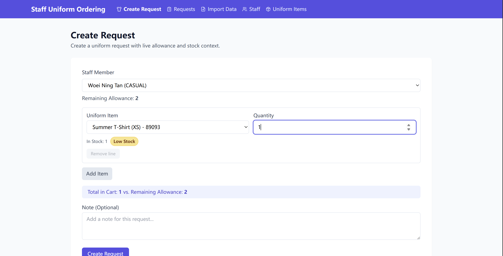
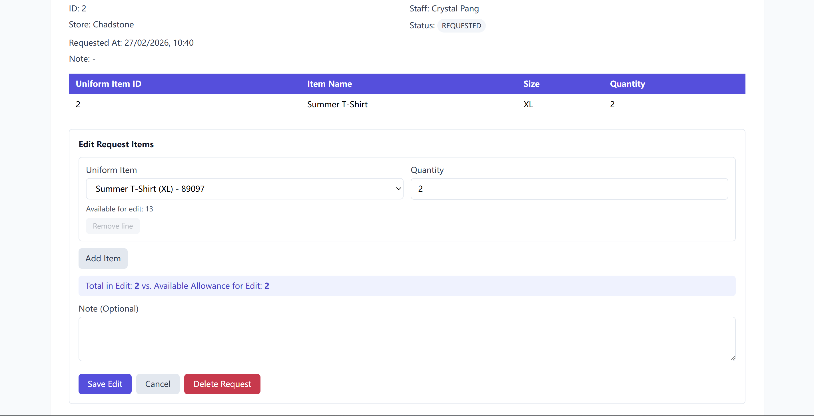
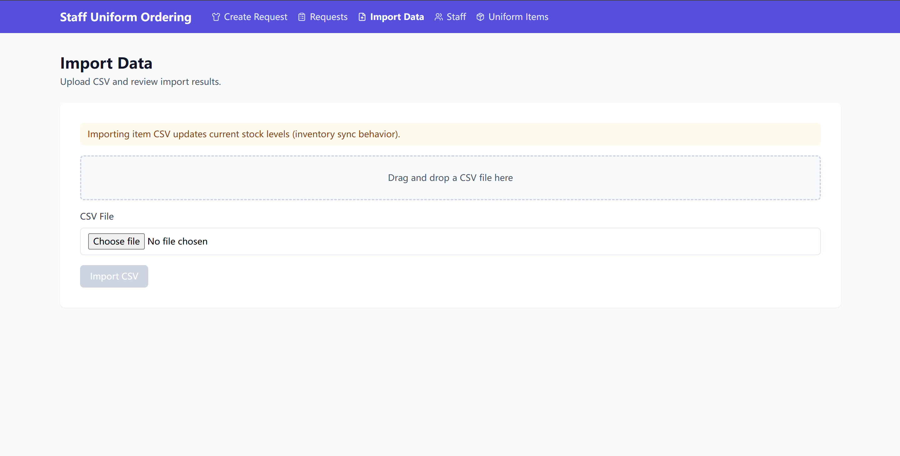
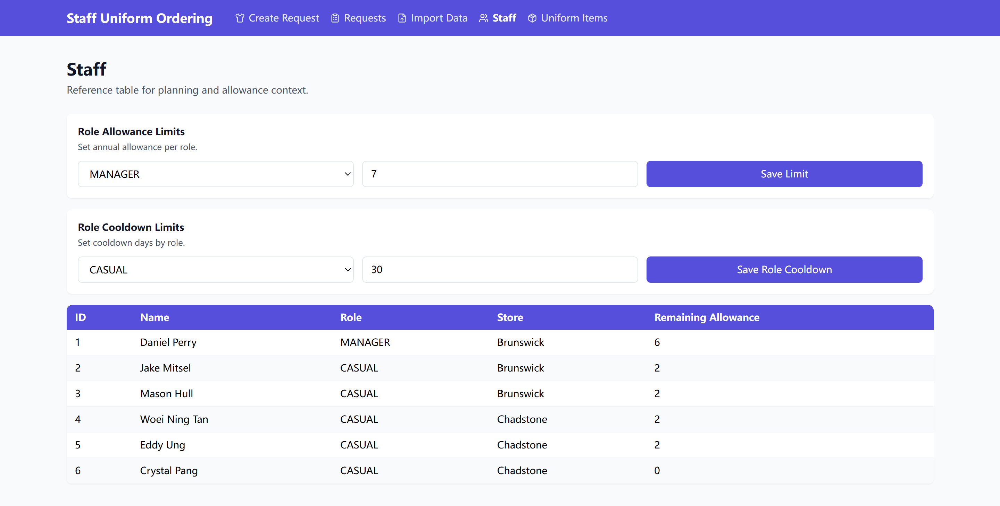

# Staff Uniform Ordering System

## 1. Project Overview
This project is a take-home full-stack feature that allows store managers to import staff/uniform data, create uniform requests with business-rule enforcement, and track request status through a defined lifecycle.

The goal is to demonstrate practical engineering in:
- Data import and validation
- Business logic enforcement
- Clean API design
- Usable operational UI

## Post-Interview Refinements
The following updates were implemented after interview discussion and are included in the current codebase:

- **Edit Request functionality**
  - Managers can edit request line items while the request is still in `REQUESTED` status.
  - The update flow rebalances stock and allowance inside a transaction to avoid partial writes.

- **Role Cooldown Limits**
  - Cooldown is configurable per role via dedicated role cooldown settings.
  - Request creation/edit cooldown checks now resolve by staff role rather than a single hardcoded value.

## Demo Preview

### 1) Create Request


### 2) Request Detail - Edit / Delete Request
Highlights:
- Edit Request functionality is supported from request detail flow.



### 3) Import Data


### 4) Staff Page - Role Allowance + Role Cooldown Limits
Highlights:
- Role Cooldown Limits are configurable by role from the Staff page.



---

## 2. Tech Stack

### Frontend
- React (Vite)
- TailwindCSS
- Fetch API

### Backend
- Node.js
- Express
- SQLite (`sqlite3`)

### Key Libraries
- `multer` (multipart file upload)
- `csv-parser` (CSV parsing)
- `cors` (cross-origin support)

---

## 3. Architecture Overview
Backend follows a layered architecture:

`routes -> controllers -> services -> repositories -> database`

- **Routes**: endpoint mapping
- **Controllers**: HTTP input/output handling
- **Services**: business rules and orchestration
- **Repositories**: SQL/data access only
- **Database**: SQLite schema and constraints

The codebase is organized by domain modules:
- requests
- imports
- staff
- uniform-items

---

## 4. Data Model Highlights
Key modeling decisions:

- **Uniform item identity**: `UNIQUE(sku, size)` to model SKU-size variants.
- **Staff identity in store context**: `UNIQUE(name, store_id)`.
- **Role allowance configuration**: `role_allowance_limits(role_name, annual_limit)`.
- **Import audit trail**:
  - `import_jobs` (summary counters)
  - `import_row_errors` (row-level failures)

Database integrity constraints include:
- `CHECK(stock_on_hand >= 0)`
- `CHECK(quantity > 0)`
- request status enum check
- foreign keys across staff, requests, items, imports

---

## 5. Business Logic
Implemented in service layer:

- **Allowance rule**: annual limit per role, calculated against current-year usage.
- **Cooldown rule**: 30-day cooldown per staff + item.
- **Stock validation**: requested quantity cannot exceed current stock.
- **Status workflow**: strict linear transitions  
  `REQUESTED -> DISPATCHED -> ARRIVED -> COLLECTED`.
- **Atomic request creation**: request + stock decrement + request items run in one DB transaction.

---

## 6. Import Strategy
Import behavior is designed for operational robustness:

- CSV type auto-detected by headers:
  - Staff CSV: `Display Name`, `Role`, `Store`
  - SKU CSV: `EAN`, `Name`, `Qty`
- **Row-level partial success**: invalid rows are logged, valid rows continue.
- **Staff idempotency**: `INSERT OR IGNORE` with unique staff/store key.
- **Inventory sync**: uniform items use UPSERT on `(sku, size)`, updating stock on re-import.

---

## 7. Validation Strategy
Validation is implemented across three levels:

1. **Frontend validation (UX guard)**
   - Required fields
   - Positive integer quantity
   - Immediate form feedback

2. **Backend authoritative validation**
   - Payload shape and type checks
   - Existence checks (staff/item)
   - Business rules (allowance/cooldown/stock/status transitions)

3. **Database constraints (final guard)**
   - CHECK / UNIQUE / FK constraints

---

## 8. Concurrency Handling
Request creation uses explicit transaction boundaries:

- `BEGIN TRANSACTION`
- create request
- atomic stock decrement (`stock_on_hand >= quantity`)
- create request items
- `COMMIT` / `ROLLBACK` on failure

This ensures no partial writes on failure paths.

---

## 9. API Design
REST-style endpoints are grouped by domain:

- `/api/imports`
- `/api/requests`
- `/api/staff`
- `/api/uniform-items`

Response contract is consistent:

- **Success**: `{ "data": ... }`
- **Error**: `{ "error": { "code": "...", "message": "..." } }`

Common error codes include:
- `VALIDATION_ERROR`
- `NOT_FOUND`
- `INSUFFICIENT_STOCK`
- `ALLOWANCE_EXCEEDED`
- `COOLDOWN_ACTIVE`
- `INVALID_STATUS_TRANSITION`

---

## 10. Setup & Run Instructions

### Prerequisites
- Node.js 18+ (recommended)
- npm 9+

### Backend
```bash
cd backend
npm install
cd src
node app.js
```

Backend runs on: `http://localhost:3000`

### Frontend
```bash
cd frontend
npm install
npm run dev
```

Frontend runs on: `http://localhost:5173`

---

## 11. Assumptions & Scope Decisions
- No authentication/authorization (explicitly out of scope for this task).
- Designed as an operational internal tool for store managers.
- Focused on correctness of business rules, data integrity, and clear UI workflows over broad feature scope.
